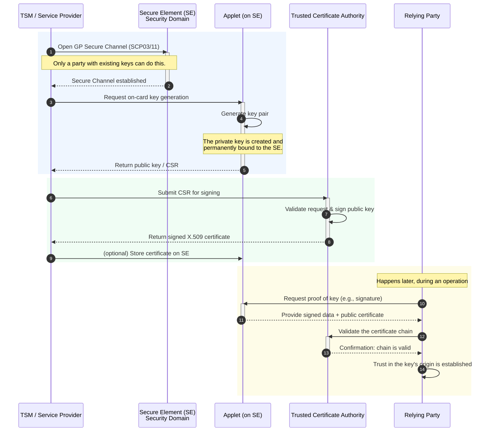
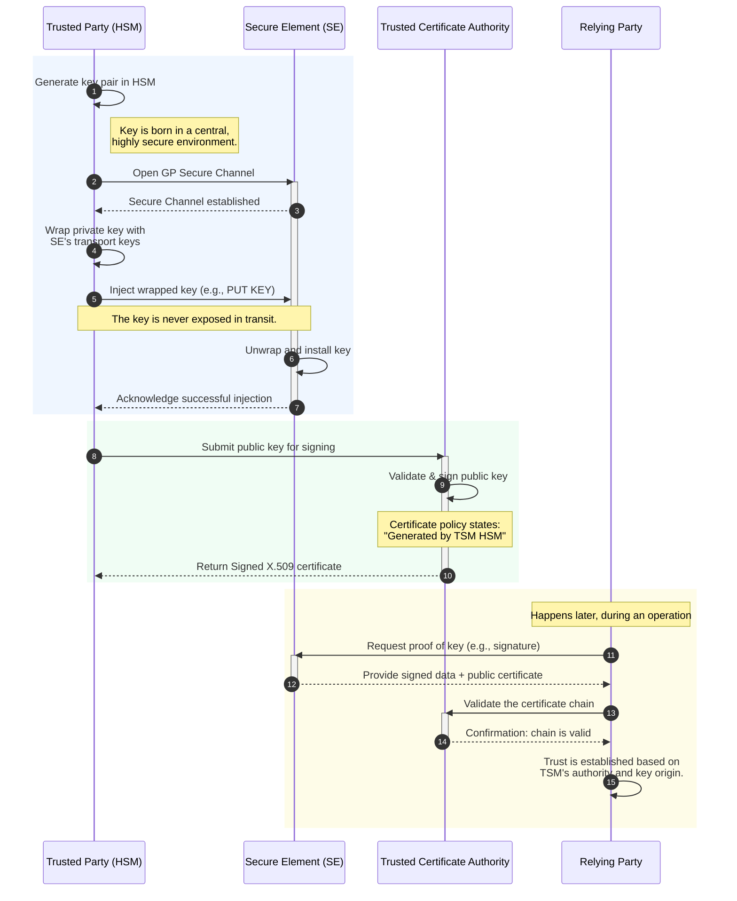
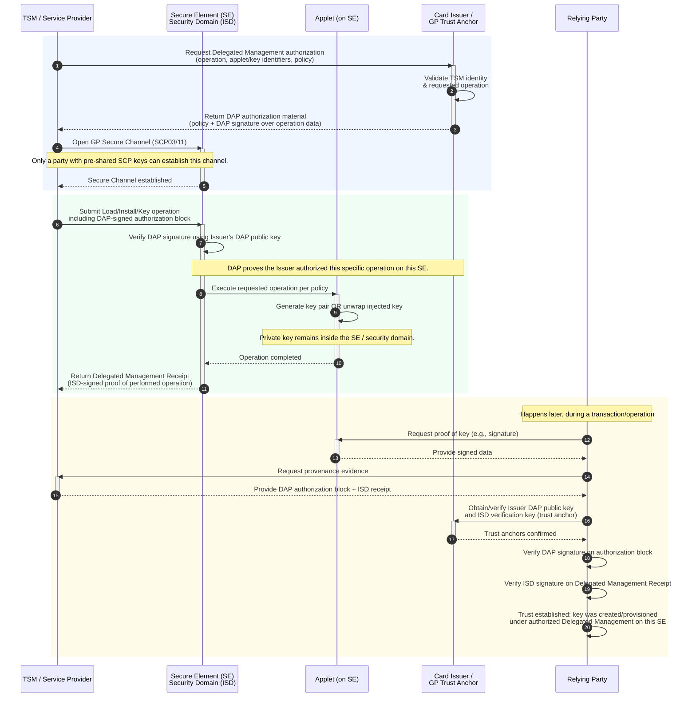
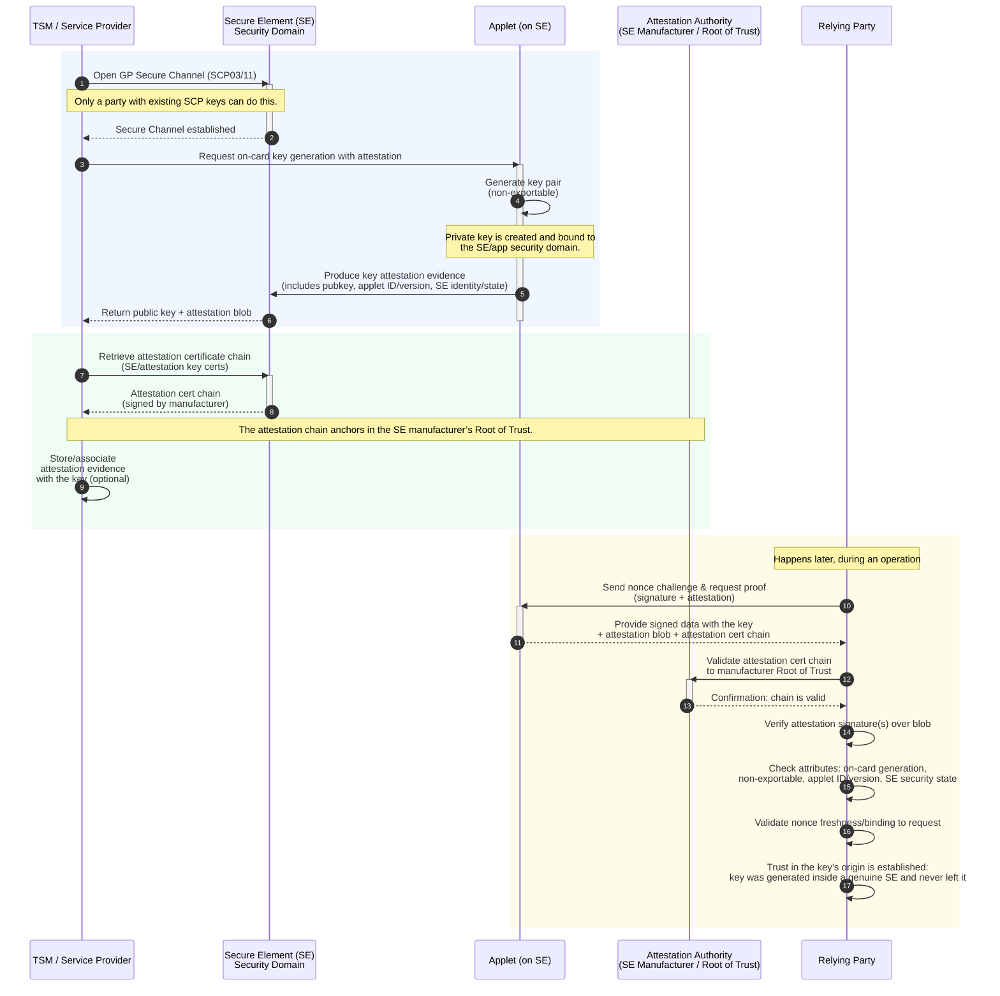

---
# try also 'default' to start simple
theme: seriph
css: style.css
# random image from a curated Unsplash collection by Anthony
# like them? see https://unsplash.com/collections/94734566/slidev
background: https://cover.sli.dev
# some information about your slides (markdown enabled)
title: Android Key Attestation
info: |
  How can we ensure a certain key is generated by a trusted party?
# apply UnoCSS classes to the current slide
class: text-center
# https://sli.dev/features/drawing
drawings:
  persist: false
# slide transition: https://sli.dev/guide/animations.html#slide-transitions
transition: slide-left
# enable MDC Syntax: https://sli.dev/features/mdc
mdc: true
---

# Android Key Attestation

Ning Zhao

  How can we ensure a certain key is generated by a trusted party? <carbon:arrow-right />

  <button @click="$slidev.nav.openInEditor()" title="Open in Editor" class="slidev-icon-btn">
    <carbon:edit />
  </button>
  <a href="https://github.com/slidevjs/slidev" target="_blank" class="slidev-icon-btn">
    <carbon:logo-github />
  </a>

<!--
The last comment block of each slide will be treated as slide notes. It will be visible and editable in Presenter Mode along with the slide. [Read more in the docs](https://sli.dev/guide/syntax.html#notes)
-->

---
layout: two-cols
layoutClass: gap-16
---

# Table of contents

The key itself can tell who generated it. 

Cryptographic evidence tied to a trusted root through either 

1. a hardware-backed attestation that says “this key was generated here, with these properties,” or 

2. a certificate chain where our trusted party signs the public key and asserts how/where it was generated. 

Both models exist in Android/eSE/TSM ecosystems, achieved through different rails.
This presentation is a practical breakdown for Android-based devices, distinguishing between **TEE/StrongBox (Android Keystore)** and **Secure Elements (eSE/UICC/SD card) managed by a TSM**.

::right::

<Toc text-sm minDepth="1" maxDepth="2" />

---
layout: image-right
layoutClass: gap-16
image: /android_key_attestation/android_key_attestation.png
---

# Key in android keystore (TEE or StrongBox) 

Mechanism: *Android Key Attestation*

### What it gives us:

- A certificate chain over the key’s public key, ending in an OEM/Google hardware attestation root.
- An attestation record signed by hardware that includes:
    - `origin = GENERATED` or `IMPORTED` (ensures not imported if we require on-device generation)
    - hardware/security level (TEE vs StrongBox)
    - key characteristics (algorithms, sizes, purposes, user auth, rollback resistance, etc.)
    - a nonce/challenge (freshness, anti-replay)
    - device identity fields (depending on keymaster version and settings)

---
layout: image-right
layoutClass: gap-16
image: /android_key_attestation/android_key_attestation_process.png
---

# Android keystore: ensuring trusted key generation

### How to ensure "generated by a trusted party":

- Define **trusted party** as “the device’s hardware TEE/StrongBox under attestation keys we trust”. Pin the attestation root(s).
- Require `origin=GENERATED` and reject `IMPORTED`.
- Verify the full chain and the attestation extensions server-side.

### When to use:
We need proof the key was created inside device hardware (not by a remote HSM/TSM) and bound to that device/security level.

---
layout: two-cols
layoutClass: gap-16
---

# Key in a Secure Element (eSE/UICC/SD) managed via a TSM

There isn’t a single Android-wide attestation API for arbitrary eSE keys. 

## Assurance relies on 

- GlobalPlatform (GP) mechanisms, 
- the TSM trust model, and/or 
- an application-level PKI.

::right::

## Common, robust patterns:

a) On-card key generation + certificate from a trusted CA

b) Trusted party (TSM/HSM) generates and injects the key under GP secure wrapping

c) GlobalPlatform Delegated Management and DAP signatures (provenance of who did what)

d) SE attestation (where supported)

---
layout: two-cols
layoutClass: gap-16
title: a) On-card key generation + certificate from a trusted CA
---

### a) On-card Key Generation + Certificate from a Trusted CA

::right::

#### What we can assert:

- The key pair was generated on the SE (not injected).
- The trusted party (our CA) vouches for it via the certificate.

#### How we verify:

- Validate the certificate chain to our trusted CA.
- Check certificate policy OIDs/constraints that encode “on-card generation” and applet identity/version.

#### Pros:
Strong, portable proof anchored in our CA. Private key stays in hardware.

#### Cons:
Requires applet support for CSR and our PKI/CA process.

---
layout: two-cols
layoutClass: gap-16
title: b) Trusted party (TSM/HSM) generates and injects the key under GP secure wrapping
---

### b) Trusted party (TSM/HSM) key

#### What we can assert:

The key was generated by that trusted HSM/TSM and delivered securely to the SE (no plaintext exposure outside secured environments).

#### How we verify:

- Again, via the certificate chain/policy that says generation took place in that HSM.
- Operationally, we rely on TSM audit/logs and the fact that only entities with SD keys could import.

#### Pros:

Lets the trusted party control key generation centrally.

#### Cons:

Private key existed outside the SE (albeit inside an HSM); some regulations prefer pure on-card generation.

::right::

---
layout: two-cols
layoutClass: gap-16
title: c) GlobalPlatform Delegated Management and DAP signatures - 1
---

#### c) GlobalPlatform Delegated Management and DAP signatures - 1
**GlobalPlatform (GP) Delegated Management** is a protocol that allows the secure provisioning and management of keys and applications on a Secure Element (SE). The **Data Authentication Pattern (DAP)** is a mechanism used by GlobalPlatform to provide proof of the origin and integrity of the operations performed on the SE.

##### What we can assert:

- The key was securely provisioned or generated on the SE by an authorized trusted party (e.g. a TSM or HSM).
  
- The provenance of who created or injected the key, and the integrity of the operation, is verified using DAP signatures.

::right::

---
layout: two-cols-header
layoutClass: gap-16
title: c) GlobalPlatform Delegated Management and DAP signatures - 2
--- 
#### c) GlobalPlatform Delegated Management and DAP signatures - 2. How we verify

::left::

##### 1. Validation of DAP signatures:
   
   - DAP signatures are cryptographic signatures applied to the data package by the trusted entity responsible for provisioning or generating the key.
     
   - Using the public key of the trusted entity (e.g.TSM), we verify the DAP signature to ensure the data package (key or applet) was not tampered with and came from the claimed trusted source.
  
::right::
         
##### 2. GlobalPlatform's Delegated Management Protocol:
   
   - The SE’s security mechanisms enforce the use of DAP signatures for key provisioning or generation.
     
   - Only trusted entities with the correct DAP signing keys can execute operations on the SE.

---
layout: two-cols-header
layoutClass: gap-16
title: c) GlobalPlatform Delegated Management and DAP signatures - 3
--- 

### c) GlobalPlatform Delegated Management and DAP signatures - 3

::left::

### Pros:

- **Provenance:** Provides strong assurance of the origin and integrity of the key, as the DAP signature proves the key was provisioned or generated by an authorized trusted party.
  
- **Scalable:** Well-suited for large-scale deployments where TSMs manage multiple devices and SEs.
  
- **No dependency on external PKI:** The DAP signature mechanism does not require integration with an external CA or PKI infrastructure.

::right::

### Cons:

- **Complexity:** Requires GlobalPlatform Delegated Management infrastructure and support on the SE.
  
- **Limited portability:** The DAP signature is specific to the provisioning process and does not provide a portable certificate like pattern (a) for external validation.
  
- **Trust delegation risk:** The trust is anchored to the TSM’s keys and infrastructure, so if the TSM is compromised, the system’s integrity is at risk.

---
layout: two-cols
layoutClass: gap-16
title: d) SE attestation (where supported) - 1
---

#### d) SE attestation (where supported) - 1

**Secure Element (SE) attestation** is a mechanism where the SE generates an attestation certificate or signature that proves the authenticity and integrity of the SE and the key generation process. This approach relies on hardware-backed attestation.

##### What we can assert:

- The key was generated inside a specific SE.
  
- The SE itself is authentic and has not been tampered with, as proven by the attestation.

- The SE is running a specific applet or firmware version that has been verified.

::right::

---
layout: two-cols
layoutClass: gap-16
title: d) SE attestation (where supported) - 2
--- 
#### d) SE attestation (where supported) - 2

##### How we verity:  

  
**1. Attestation Certificate Chain:**
- The SE generates an attestation certificate (or signature) signed by a trusted entity, such as the SE manufacturer or a Root of Trust (RoT).
- The attestation certificate includes information about the SE, such as its hardware ID, applet version, and possibly the key properties.

**2. Validation of Attestation Signature:**
- Using the public key of the trusted entity (e.g., SE manufacturer’s RoT), we verify the attestation signature to ensure it is valid and that the SE is genuine.
- Confirm that the attestation includes attributes indicating the key was generated inside the SE and has not been exported.

**3. Policy Checks:**
- Verify that the SE’s firmware version, applet version, and attestation attributes meet our security requirements.

  

::right::

##### Pros:

  
- **Strong hardware-backed proof:** Provides strong assurance that the key was generated on a genuine SE and never left the secure hardware.

- **No reliance on external provisioning:** Unlike patterns a) and b), the key generation process is self-contained within the SE.

- **Portable attestation proof:** The attestation certificate can be used externally to prove the key’s origin.

##### Cons:

  
- **Dependency on SE manufacturer:** Requires support for attestation from the SE vendor, and trust is rooted in the SE manufacturer’s RoT.

- **SE firmware/app support:** Not all SEs support attestation, and support may vary between vendors.

- **Complex verification process:** Verifying attestation certificates and attributes may require specialized tools and infrastructure.

---
layout: two-cols
layoutClass: gap-16
---

# Bringing it together

How to “ensure a certain key is generated by a trusted party”

### Define “trusted party”

- The device’s secure hardware (TEE/StrongBox) itself? Use Android Key Attestation and require `origin=GENERATED`.
- The TSM/HSM? Have it sign the public key (certificate) asserting generation in its HSM; or rely on GP logs plus certificate policy.
- The eSE itself? Use on-card keygen plus either
  1. a CA certificate stating on-card generation, or
  2. an SE vendor/issuer attestation if supported.

### Require a verifiable artifact

- For Keystore: hardware attestation chain.
- For eSE: X.509 certificate chain with explicit policy OIDs, or SE attestation evidence, chained to a root we pin.

::right::

### Pin the trust anchors:
- OEM/Google attestation roots for Android Keystore.
- Your organization’s CA or the SE issuer’s CA for eSE/app-level PKI.

### Reject imports if we require on-device/on-card generation:
- Keystore: check `origin=GENERATED`.
- eSE: policy in cert must state on-card generation; don’t accept keys without that policy.

### Maintain operational controls:
- Use GP SCP03/SCP11 for provisioning and rotate SD keys.
- Keep TSM actions in an HSM with audit logs.
- Use DAP/Delegated Management to restrict who can load/manage applets.

---
---

# Decision matrix - key management approaches

| **Use Case** | **Key Generation & Storage** | **Certificate Policy** | **Trust / Validation Model** | **Key Management Flow** |
|---------------|------------------------------|--------------------------|-------------------------------|--------------------------|
| **App Login (device-generated, hardware-bound)** | Generated in **Android Keystore**, hardware-backed; attested origin = `GENERATED` | N/A (implicit trust via attestation) | Relying party verifies **attestation chain** and **pins roots** | App requests keypair → Keystore generates → Attestation included in auth flow |
| **Issuer-controlled keys in eSE applet (e.g., payments, transit)** | Generated **on-card** via TSM command (`GenerateKeyPair`); keys stored in **embedded Secure Element (eSE)** | Cert issued by **Issuer CA** with policy = “on-card gen” | Relying parties validate to **Issuer CA** | TSM triggers on-card keygen → CSR from eSE → Issuer CA issues cert → Cert distributed via TSM |
| **TSM-generated keys (provably from issuer HSM)** | Generated centrally in **HSM**, then **injected** to card/app via **GlobalPlatform (GP) secure channel** | Cert issued by **Issuer CA** with policy = “HSM-generated” | Relying parties **pin issuer CA** | HSM generates key → TSM injects to target → Issuer CA issues cert referencing HSM-origin policy |

---
---

# Key takeaways

- The guarantee comes from cryptographic evidence tied to a root we trust, not from the key itself.

- In Android Keystore, that evidence is hardware attestation.

- In Secure Element/TSM workflows, that evidence is typically an X.509 certificate (and/or SE attestation) plus GlobalPlatform-controlled provisioning paths.

- Encode our requirements (on-card vs HSM generation, algorithms, key usage) in verifiable policy and reject anything that lacks the right evidence.

