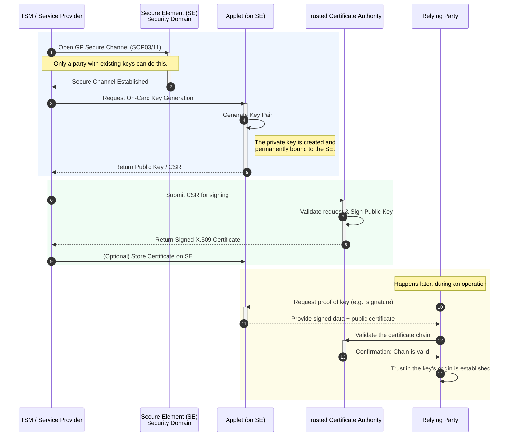
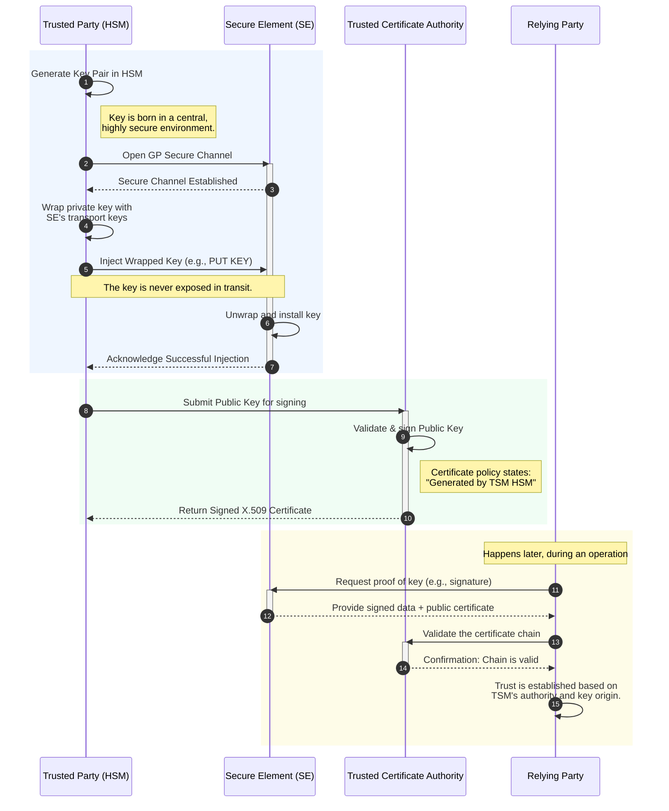

---
# try also 'default' to start simple
theme: seriph
# css: global.css
# random image from a curated Unsplash collection by Anthony
# like them? see https://unsplash.com/collections/94734566/slidev
background: https://cover.sli.dev
# some information about your slides (markdown enabled)
title: Android Key Attestation
info: |
  How can we ensure a certain key is generated by a trusted party?
# apply UnoCSS classes to the current slide
class: text-center
# https://sli.dev/features/drawing
drawings:
  persist: false
# slide transition: https://sli.dev/guide/animations.html#slide-transitions
transition: slide-left
# enable MDC Syntax: https://sli.dev/features/mdc
mdc: true
---

# Android Key Attestation

Ning Zhao

  How can we ensure a certain key is generated by a trusted party? <carbon:arrow-right />

  <button @click="$slidev.nav.openInEditor()" title="Open in Editor" class="slidev-icon-btn">
    <carbon:edit />
  </button>
  <a href="https://github.com/slidevjs/slidev" target="_blank" class="slidev-icon-btn">
    <carbon:logo-github />
  </a>

<!--
The last comment block of each slide will be treated as slide notes. It will be visible and editable in Presenter Mode along with the slide. [Read more in the docs](https://sli.dev/guide/syntax.html#notes)
-->

---
layout: two-cols
layoutClass: gap-16
---

# Table of contents

The key itself can tell who generated it. 

Cryptographic evidence tied to a trusted root through either 

1. a hardware-backed attestation that says “this key was generated here, with these properties,” or 

2. a certificate chain where our trusted party signs the public key and asserts how/where it was generated. 

Both models exist in Android/eSE/TSM ecosystems, achieved through different rails.
This presentation is a practical breakdown for Android-based devices, distinguishing between **TEE/StrongBox (Android Keystore)** and **Secure Elements (eSE/UICC/SD card) managed by a TSM**.

::right::

<Toc text-sm minDepth="1" maxDepth="2" />

---
layout: image-right
layoutClass: gap-16
image: /android_key_attestation/android_key_attestation.jpg
---

# Key in Android Keystore (TEE or StrongBox) 

Mechanism: *Android Key Attestation*

### What it gives us:

- A certificate chain over the key’s public key, ending in an OEM/Google hardware attestation root.
- An attestation record signed by hardware that includes:
    - `origin = GENERATED` or `IMPORTED` (ensures not imported if we require on-device generation)
    - hardware/security level (TEE vs StrongBox)
    - key characteristics (algorithms, sizes, purposes, user auth, rollback resistance, etc.)
    - a nonce/challenge (freshness, anti-replay)
    - device identity fields (depending on keymaster version and settings)

---
layout: image-right
layoutClass: gap-16
image: /android_key_attestation/android_key_attestation_process.png
---

# Android Keystore: Ensuring Trusted Key Generation

### How to ensure "generated by a trusted party":

- Define **trusted party** as “the device’s hardware TEE/StrongBox under attestation keys we trust”. Pin the attestation root(s).
- Require `origin=GENERATED` and reject `IMPORTED`.
- Verify the full chain and the attestation extensions server-side.

### When to use:
We need proof the key was created inside device hardware (not by a remote HSM/TSM) and bound to that device/security level.

---
layout: two-cols
layoutClass: gap-16
---

# Key in a Secure Element (eSE/UICC/SD) Managed via a TSM

There isn’t a single Android-wide attestation API for arbitrary eSE keys. 

## Assurance relies on 

- GlobalPlatform (GP) mechanisms, 
- the TSM trust model, and/or 
- an application-level PKI.

::right::

## Common, robust patterns:

a) On-card key generation + certificate from a trusted CA

b) Trusted party (TSM/HSM) generates and injects the key under GP secure wrapping

c) GlobalPlatform Delegated Management and DAP signatures (provenance of who did what)

d) SE attestation (where supported)

---
layout: two-cols
layoutClass: gap-16
title: a) On-card key generation + certificate from a trusted CA
---

### a) On-card Key Generation + Certificate from a Trusted CA

::right::

#### What we can assert:

- The key pair was generated on the SE (not injected).
- The trusted party (our CA) vouches for it via the certificate.

#### How we verify:

- Validate the certificate chain to our trusted CA.
- Check certificate policy OIDs/constraints that encode “on-card generation” and applet identity/version.

#### Pros:
Strong, portable proof anchored in our CA. Private key stays in hardware.

#### Cons:
Requires applet support for CSR and our PKI/CA process.

---
layout: two-cols
layoutClass: gap-16
title: b) Trusted party (TSM/HSM) generates and injects the key under GP secure wrapping
---

### b) Trusted party (TSM/HSM) key

#### What we can assert:

The key was generated by that trusted HSM/TSM and delivered securely to the SE (no plaintext exposure outside secured environments).

#### How we verify:

- Again, via the certificate chain/policy that says generation took place in that HSM.
- Operationally, we rely on TSM audit/logs and the fact that only entities with SD keys could import.

#### Pros:

Lets the trusted party control key generation centrally.

#### Cons:

Private key existed outside the SE (albeit inside an HSM); some regulations prefer pure on-card generation.

::right::

---
---

# c) GlobalPlatform Delegated Management and DAP signatures (provenance of who did what)

- Use GP Delegated Management (DAP) and associated signatures to prove that only a specific service provider (or TSM) loaded an applet or executed management commands on the SE.

- While DAP proves who authorized/installed content, it does not by itself prove key origin. Combine with (A) or (B) and our PKI policies to get clear provenance.

---
---

# d) SE attestation (where supported)

- Some SE vendors/applet stacks support attestation of keys (similar in spirit to Android Key Attestation, but not standardized across all eSEs).

- If available, we can obtain an attestation statement signed by an SE vendor/issuer root that claims “this key was generated inside this SE/applet.”

- Verify the attestation chain to a root we trust.

---
layout: two-cols
layoutClass: gap-16
---

# Bringing It Together

How to “ensure a certain key is generated by a trusted party”

### Define “trusted party”

- The device’s secure hardware (TEE/StrongBox) itself? Use Android Key Attestation and require `origin=GENERATED`.
- The TSM/HSM? Have it sign the public key (certificate) asserting generation in its HSM; or rely on GP logs plus certificate policy.
- The eSE itself? Use on-card keygen plus either
  1. a CA certificate stating on-card generation, or
  2. an SE vendor/issuer attestation if supported.

### Require a verifiable artifact

- For Keystore: hardware attestation chain.
- For eSE: X.509 certificate chain with explicit policy OIDs, or SE attestation evidence, chained to a root we pin.

::right::

### Pin the trust anchors:
- OEM/Google attestation roots for Android Keystore.
- Your organization’s CA or the SE issuer’s CA for eSE/app-level PKI.

### Reject imports if we require on-device/on-card generation:
- Keystore: check origin=GENERATED.
- eSE: policy in cert must state on-card generation; don’t accept keys without that policy.

### Maintain operational controls:
- Use GP SCP03/SCP11 for provisioning and rotate SD keys.
- Keep TSM actions in an HSM with audit logs.
- Use DAP/Delegated Management to restrict who can load/manage applets.

---
---

# Decision matrix - Key Management Approaches

| **Use Case** | **Key Generation & Storage** | **Certificate Policy** | **Trust / Validation Model** | **Key Management Flow** |
|---------------|------------------------------|--------------------------|-------------------------------|--------------------------|
| **App Login (device-generated, hardware-bound)** | Generated in **Android Keystore**, hardware-backed; attested origin = `GENERATED` | N/A (implicit trust via attestation) | Relying party verifies **attestation chain** and **pins roots** | App requests keypair → Keystore generates → Attestation included in auth flow |
| **Issuer-controlled keys in eSE applet (e.g., payments, transit)** | Generated **on-card** via TSM command (`GenerateKeyPair`); keys stored in **embedded Secure Element (eSE)** | Cert issued by **Issuer CA** with policy = “on-card gen” | Relying parties validate to **Issuer CA** | TSM triggers on-card keygen → CSR from eSE → Issuer CA issues cert → Cert distributed via TSM |
| **TSM-generated keys (provably from issuer HSM)** | Generated centrally in **HSM**, then **injected** to card/app via **GlobalPlatform (GP) secure channel** | Cert issued by **Issuer CA** with policy = “HSM-generated” | Relying parties **pin issuer CA** | HSM generates key → TSM injects to target → Issuer CA issues cert referencing HSM-origin policy |

---
---

# Key takeaways

- The guarantee comes from cryptographic evidence tied to a root we trust, not from the key itself.

- In Android Keystore, that evidence is hardware attestation.

- In Secure Element/TSM workflows, that evidence is typically an X.509 certificate (and/or SE attestation) plus GlobalPlatform-controlled provisioning paths.

- Encode our requirements (on-card vs HSM generation, algorithms, key usage) in verifiable policy and reject anything that lacks the right evidence.

