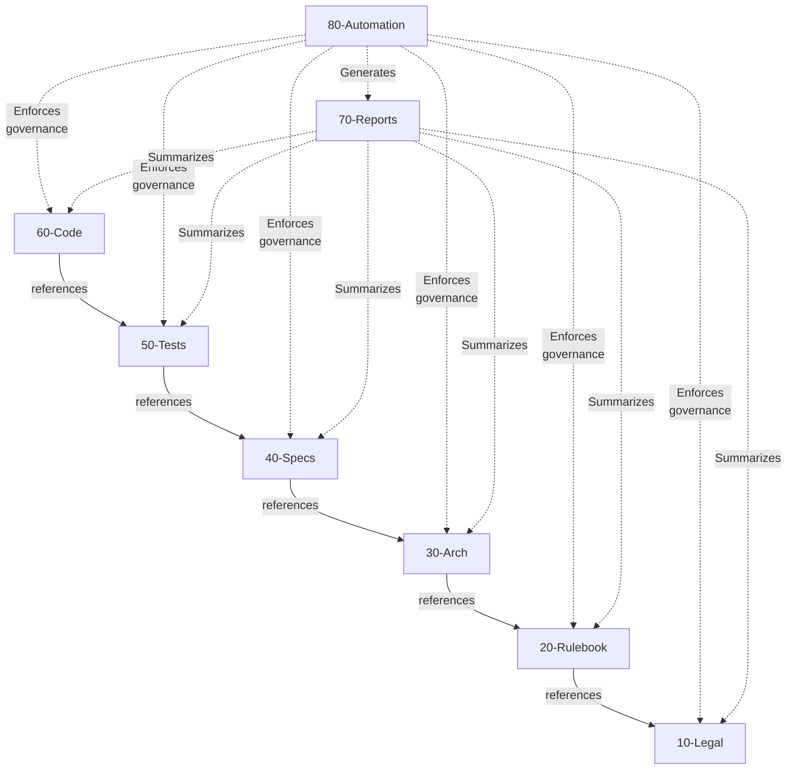
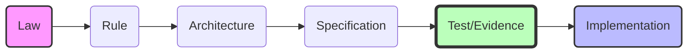

# Élan
## Institutional Governance Engineering

The disciplined momentum of a system that knows *why* it moves.

  <a href="https://github.com/nnworkspace/elan" target="_blank" alt="GitHub"
    class="text-xl slidev-icon-btn opacity-50 !border-none !hover:text-white">
    <carbon-logo-github />
  </a>

<!--
Presenter Notes:
- Welcome everyone.
- Title: Élan. Derived from "Enable Automation".
- Purpose: A workbench for high-stakes projects (like Digital Euro).
-->

---
transition: fade-out
---

# The Institutional Challenge

Why do large-scale institutional projects struggle?

### It's rarely a lack of domain skill.
It's usually **Semantic Entropy**.

The gap between:
- **Policy Intent** (Laws, Rules)
- **Technical Implementation** (Code, configs)

### The Symptom: Documentation Theatre

- **Rules** live in static Word documents or PDFs.
- **Code** lives in dynamic Git.
- **They drift apart.**

<!--
Presenter Notes:
- We have great lawyers and great engineers.
- The problem is the gap between them.
- "Semantic Entropy": The gradual loss of meaning as you move from Policy to Code.
-->

---

# The Solution: Élan

A demonstrative workbench for **Institutional Governance Engineering**.

## Philosophy: Integrity > Velocity

In high-stakes environments (e.g., Currency, Medical, Aerospace), you must prove that **what you built matches what you intended**.

 

### The "V-Model" Reimagined
It is not about a slow waterfall process. It is about explicit **Layers of Intent**.

---

# The Anatomy of the Workbench

A visual stacking of intent.

| Layer | Name | Purpose |
|---|---|---|
| **00** | **Project Governance** | The "Constitution" |
| **10** | **Legal Framework** | The Mandate |
| **20** | **Rulebook** | The Operational Logic |
| **30** | **Architecture** | The Design & Boundaries |
| **40** | **Specifications** | The Load-Bearing Structure |
| **50** | **Tests** | **The Evidence** |
| **60** | **Code** | The Implementation |
| **70** | **Reports** | **The Confidence** |
| **80** | **Automation** | The "Police" |

---

# 00-project-governance: The Constitution

The rules of the workbench.

### Normative by Design
Governance is not an overlay. It is **part of the system**.

- **Who**: Project Governance Board.
- **What**: Defines how we work, not what we build.
- **Why**: To prevent institutional amnesia.

### Key Purpose
Establishes the **Fundamental Constraints**:

1.  **Classification**: What is Public vs. Restricted?
2.  **Traceability**: How do we link Policy to Code?
3.  **Auditability**: How do we prove what happened?

> "Civilised systems begin with law."

---

# 00-project-governance: The Instruments

We use precise instruments to enforce the constitution.

### artefact-classification.md
**Visibility & Handling**.
Every file must declare its audience (Public, Confidential) and Owner.

### logical-system-and-visibility.md
**The Boundary**.
Logical Unity vs. Physical Distribution. The system is one, even if repos are many.

### branching-strategy.md
**The Workflow**.
Protected Main. Feature Branches. No Release Branches (Tags only).

### commit-message-conventions.md
**The History**.
Strict rules (Conventional Commits) to ensure the git log is an audit trail.

### linting-rules.md
**The Enforcer**.
Automated rules (`LINT-C1`) that fail the build if governance is violated.

---

# 00-project-governance: Configuration Management

How we maintain order over time.

### The Philosophy: Atomic Baselines
We do not version files. **We version Sets**.

- **Manifests** (`manifest.yaml`) are the Single Source of Truth.
- A "Release" is a snapshot of verifyable, compatible components.

### Version-Aware Traceability
Dependencies are explicit.

`Trace: @spec=SPEC-SET-ONB:1.2.0`

**Drift Detection**:
If code targets `v1.2.0` but the spec is `v1.3.0`, the build fails.

> "Civilised systems require a shared understanding of time and state."

---

# 30-Architecture: The Blueprint

Architecture acts as both **Reference** and **Constraint**.

### Three Primary Views

- **System Context**  
  High-level ecosystem view.
- **Component Inventory**  
  Logical blocks & services.
- **Security & Privacy Zones**  
  Data boundaries & trust.

### Traceability Bridge
Specifications are **anchored** to the architecture.

`Upstream Arch: @arch=SET-ARCH:0.1.0`

**Constraint**: You cannot specify a feature that violates the architectural boundaries.

> "Architecture tells the builder **where** the walls are, so the Specification can define **how** to paint them."

---

# 40-Specifications: The Pivot Point

Specifications are the **load-bearing structure** of the project.

### What they are NOT
- Tickets (Jira, Issues)
- Ephemera
- "Nice to have"

### What they ARE
- **Stable**
- **Versioned**
- **Machine-Readable**
- **Normative**

> "Tickets coordinate work. Specifications define the system."

---

# 50-Tests: The Evidence (Test-Driven Governance)

We define **HOW** we verify before we build **WHAT** verifies.

### Claims
"The system must preclude reverse-waterfall failure."

### Evidence
"Here is the cryptographic proof / test run that confirms it."

 

**Key Principle**:
Verification artefacts (50) are **upstream** of Implementation (60).
Code exists primarily to **pass the tests** and produce the evidence.

---

# 60-Code: The Workbench

Implementation is distributed, but governance is unified.

### Component-Based
- **Not a Monolith**.
- Components owned by different institutions (ECB, PSPs, etc.).
- Different technology stacks (Java, Node, Rust).

### Unified by Governance
- Every component has a `manifest.yaml`.
- Every component traces back to `40-Specs`.
- Every component is policed by `80-Automation`.

---

# 80-Automation: The "Police"

Active Governance vs. Passive Documentation.

**Bureaucracy-as-Code**
Linting rules (`LINT-C1`, `LINT-T2`) enforce the constitution.

```mermaid
sequenceDiagram
    participant Dev as Developer
    participant Git as Workbench
    participant CI as 80-Automation
    
    Dev->>Git: Commit Code
    Git->>CI: Trigger Pipeline
    CI->>CI: Check Traceability (Spec -> Code)
    CI->>CI: Check Evidence (Tests Passed?)
    
    alt Violation
        CI-->>Dev: ❌ Reject: "LINT-T2: Missing Spec Reference"
    else Compliance
        CI-->>Dev: ✅ Accept & Generate Report
    end
```

---

# 70-Reports: The Confidence (For Managers)

Where "Trust" becomes visible.

### Not Manual Status Slides
These are **Automated, Truth-Based Views**.

*   **Progress**: What % of the Rulebook is implemented?
*   **Coverage**: Which specs are missing tests?
*   **Compliance**: Are we legally safe?

 

Managers do not need to read code. They need to read **Audit-Ready Evidence**.
This folder provides exactly that, generated fresh on every commit.

---

# Traceability: The Golden Thread

Every artefact is linked.

If the chain breaks, the build fails.

---
layout: center
class: text-center
---

# Summary

**Élan** is a system that allows diverse builders to work together without losing intent.

It replaces "Trust me" with **"Here is the proof"**.

  Clone. Fork. Adapt.

