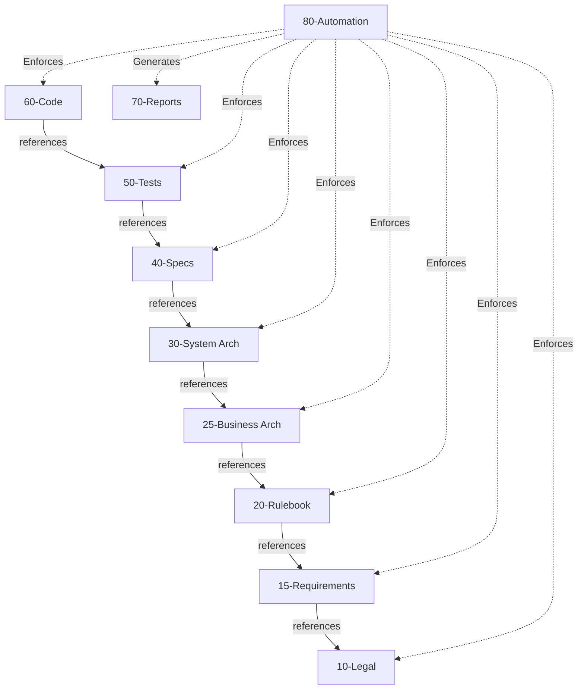
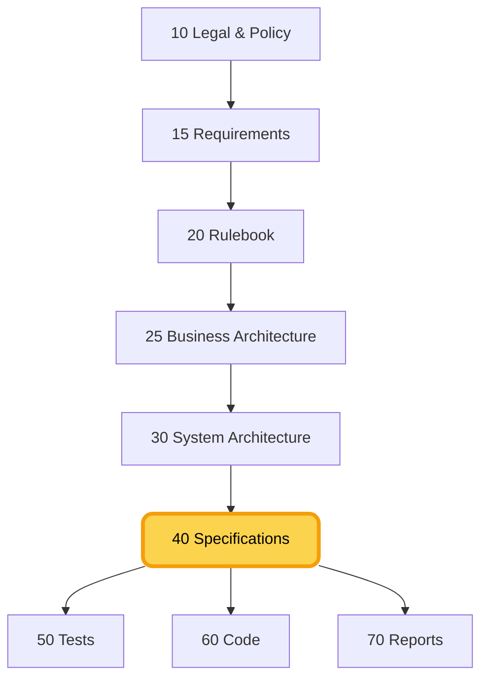
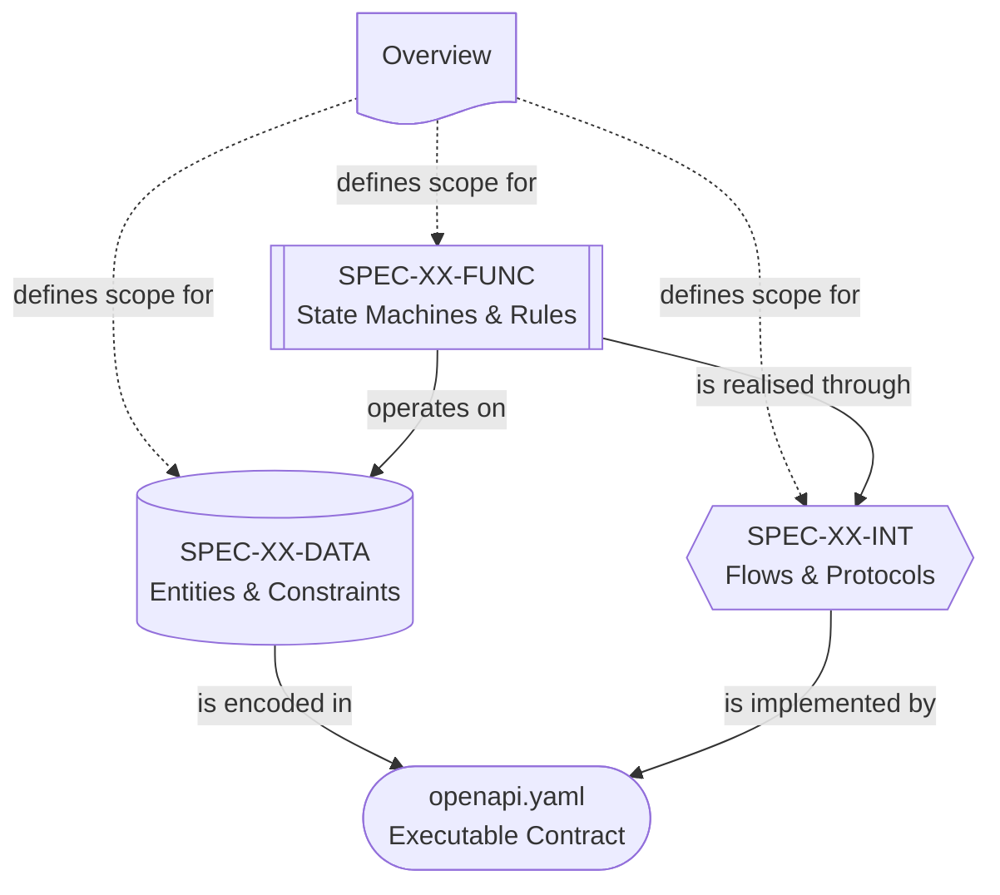
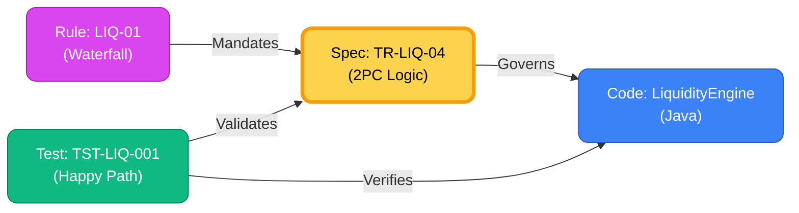
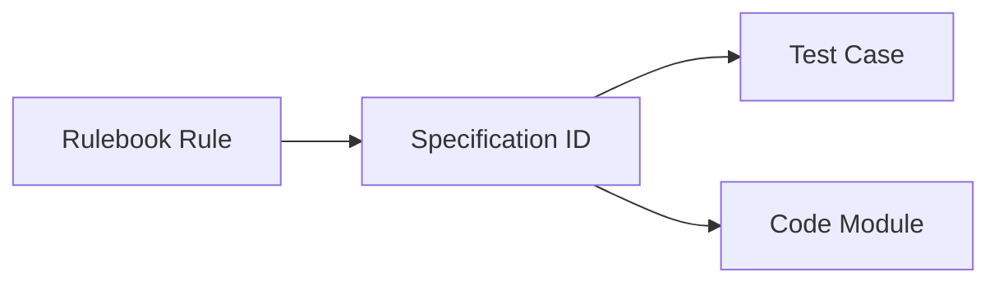
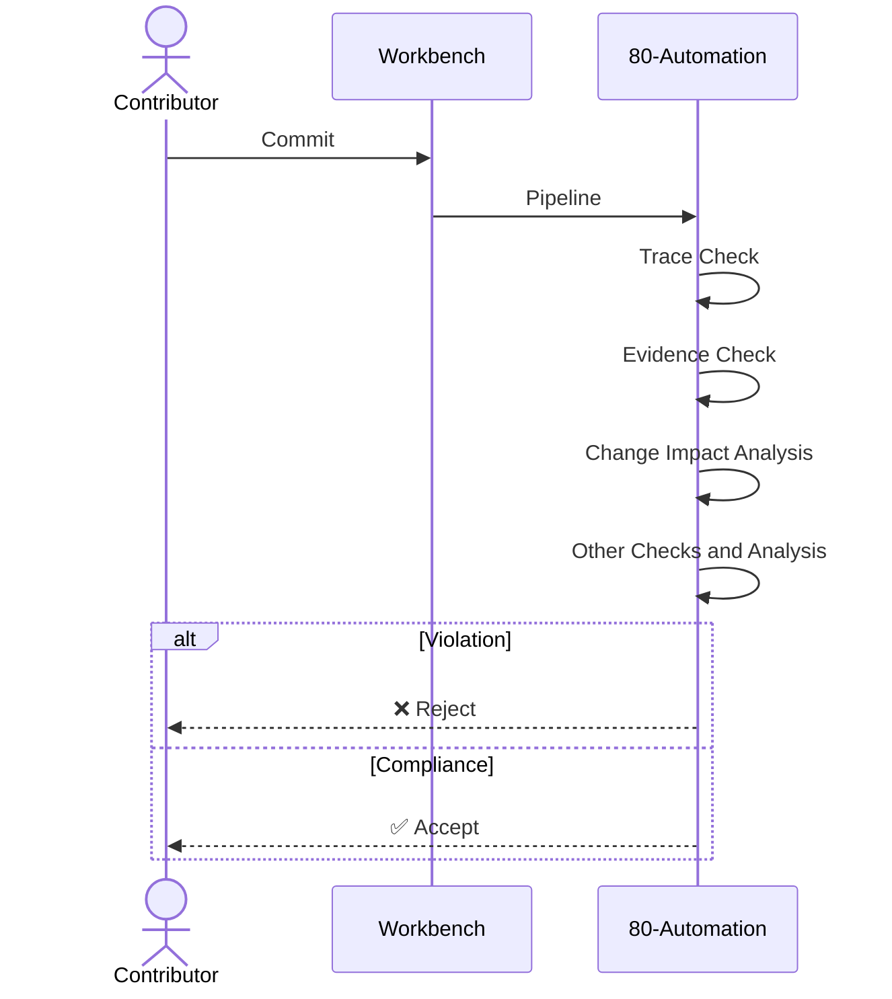

# Élan
## Institutional Governance Engineering

The disciplined momentum of a system that knows *why* it moves.

  <a href="https://github.com/nnworkspace/elan" target="_blank" alt="GitHub"
    class="text-xl slidev-icon-btn opacity-50 !border-none !hover:text-white">
    <carbon-logo-github />
  </a>

Ning Zhao

<!--
Presenter Notes:
- Welcome everyone.
- Title: Élan. Derived from "Enable Automation".
- Purpose: A workbench for high-stakes projects (like Digital Euro).
-->

---
transition: fade-out
---

# The Institutional Challenge

Why do large-scale institutional projects struggle?

### It's rarely a lack of domain skill.
It's usually **Semantic Entropy**.

The gap between:
- **Policy Intent** (Laws, Rules)
- **Technical Implementation** (Code, configs)

### The Symptom: Documentation Theatre

- **Policy** lives in OpenText servers
- **Requirements** live in Jira tickets
- **Architecture** lives in SharePoint documents
- **Code** lives in Git repositories
- **Tests** live somewhere else
- **They drift apart.**

 

> Civilisations do not fail because they lack ambition. They fail when intent cannot survive the journey from vision to execution.

<!--
Presenter Notes:
- We have great lawyers and great engineers.
- The problem is the gap between them.
- "Semantic Entropy": The gradual loss of meaning as you move from Policy to Code.
-->

---

# The Solution: Élan

A demonstrative workbench for **Institutional Governance Engineering**.

## Philosophy: Disciplined Momentum

_A system that moves with confidence, because its constraints are visible, its intent explicit, and its decisions traceable in a logically unified environment._

 

### The "V-Model" Reimagined
It is not about a slow waterfall process. It is about explicit **Layers of Intent** supercharged by Markdown, Git, and modern automation.

---

# The Anatomy of the Workbench

A visual stacking of intent.

| Layer | Name | Purpose |
|---|---|---|
| **00** | **Project Governance** | The "Constitution" |
| **10** | **Legal Framework** | The Mandate |
| **15** | **Requirements** | The Needs |
| **20** | **Rulebook** | The Operational Logic |
| **25** | **Business Architecture** | Interactions & Privacy |
| **30** | **System Architecture** | The Components |
| **40** | **Specifications** | Load-Bearing Structure |
| **50** | **Tests** | **The Evidence** |
| **60** | **Code** | The Implementation |
| **70** | **Reports** | **The Confidence** |
| **80** | **Automation** | The "Police" |

---

# 00-project-governance: The Constitution

The rules of the workbench.

### Normative by Design
Governance is not an overlay. It is **part of the system**.

- **Who**: Project Governance Board.
- **What**: Defines how we work, not what we build.
- **Why**: To prevent institutional amnesia.

### Key Purpose
Establishes the **Fundamental Constraints**:

1.  **Classification**: What is Public vs. Restricted?
2.  **Traceability**: How do we link Policy to Code?
3.  **Auditability**: How do we prove what happened?

 

> Civilised systems begin with law.

```mermaid {scale: 0.45}
graph LR
    Req(15-requirements) --> |traces| Law(10-legal)
    Rule(20-rulebook) --> |traces| Req
    BArch(25-business-arch) --> |traces| Rule
    SArch(30-system-arch) --> |traces| BArch
    Spec(40-specifications) --> |traces| SArch
    Test(50-tests) --> |traces| Spec
    Impl(60-code) --> |traces| Test
    
    style Law fill:#f9f,stroke:#333,stroke-width:2px
    style Impl fill:#bbf,stroke:#333,stroke-width:2px
    style Test fill:#bfb,stroke:#333,stroke-width:4px
```

 

If the chain breaks, the build fails.

---

# 00-project-governance: The Instruments

We use precise instruments to enforce the constitution.

<a href="https://github.com/nnworkspace/elan/blob/main/00-project-governance/artefact-classification.md" target="_blank" class="block !text-current !no-underline hover:scale-[1.02] transition-transform duration-200">

  <h4><code>artefact-classification.md</code></h4>
  
<b>Visibility & Handling</b>. Every file must declare its classification (public, restricted, confidential), owner, and audience in the front matter.

</a>

<a href="https://github.com/nnworkspace/elan/blob/main/00-project-governance/logical-system-and-visibility.md" target="_blank" class="block !text-current !no-underline hover:scale-[1.02] transition-transform duration-200">

  <h4><code>logical-system-and-visibility.md</code></h4>
  
<b>The Boundary</b>. Logical Unity vs. Physical Distribution. The system is one, even if repos are many.

</a>

<a href="https://github.com/nnworkspace/elan/blob/main/00-project-governance/communication-and-project-management.md" target="_blank" class="block !text-current !no-underline hover:scale-[1.02] transition-transform duration-200">

  <h4><code>communication-and-project-management.md</code></h4>
  
<b>The Dialogue</b>. "Communication is part of the system." Issues are records of reasoning, not just task trackers.

</a>

<a href="https://github.com/nnworkspace/elan/blob/main/00-project-governance/branching-strategy.md" target="_blank" class="block !text-current !no-underline hover:scale-[1.02] transition-transform duration-200">

  <h4><code>branching-strategy.md</code></h4>
  
<b>The Workflow</b>. Protected Main. Feature Branches. No Release Branches (Tags only).

</a>

<a href="https://github.com/nnworkspace/elan/blob/main/00-project-governance/commit-message-conventions.md" target="_blank" class="block !text-current !no-underline hover:scale-[1.02] transition-transform duration-200">

  <h4><code>commit-message-conventions.md</code></h4>
  
<b>The History</b>. Strict rules (Conventional Commits) to ensure the git log is an audit trail.

</a>

<a href="https://github.com/nnworkspace/elan/blob/main/00-project-governance/linting-rules.md" target="_blank" class="block !text-current !no-underline hover:scale-[1.02] transition-transform duration-200">

  <h4><code>linting-rules.md</code></h4>
  
<b>The Enforcer</b>. Automated rules (<code>LINT-C1</code>) that fail the build if governance is violated.

</a>

---

# 00 Linting: The Automatic Enforcement of Governance

> **Linting**: an automated check that scans files and **rejects changes** when they violate predefined rules.

**No meetings. No reminders. No interpretation.**

Just: _Rule violated → change refused by Git._

 

### In most software projects
Linting checks code style and syntax.  
Helpful, but not essential.

### In Élan
Linting checks **mandate compliance**:

- Does this spec reference the Rulebook?
- Does it match the Architecture version?
- Are privacy rules violated in the code?
- Do tests and code cite the correct specification?

If yes: ❌ The build fails. The change cannot be merged.

 

> **The Git repository itself becomes the guardian of intent.**

---

# 00 Configuration Management

How we maintain order over time.

### The Philosophy: Atomic Baselines
We do not version files. **We version Sets**.

- **Manifests** (`manifest.yaml`) are the Single Source of Truth.
- A "Release" is a snapshot of verifyable, compatible components.

### Version-Aware Traceability
Dependencies are explicit.

`Trace: @spec=SPEC-SET-ONB:1.2.0`

**Drift Detection**:
If code targets `v1.2.0` but the spec is `v1.3.0`, the build fails.

 

> Civilised systems require a shared understanding of time and state.

---

# 10-legal-framework: The Mandate

Policy is not background context; it is **foundational input**.

### Purpose
Preserve legislative intent so it survives the journey to code.

- **Content**: Treaties, Regulations, Acts.
- **Role**: Defines **Rights**.
- **Form**: The external authority every layer below must trace to.

### Why it leads
Every rule, specification, and line of code ultimately answers to a mandate here. Nothing downstream may invent authority the law did not grant.

 

> The mandate is the root of the chain of custody.

---

# 15-requirements: Where the Rules Come From

Between the mandate and the rulebook: the **needs**.

### Purpose
Capture intent in the language of people, before it becomes operational logic.

- **User journeys**: how real actors experience the system.
- **Functional requirements**: what must be possible (the URD).
- **End-to-end flows**: the paths that cross many rules.

### Two flows, never conflated

- **Down (derivation):** traceability flows Rulebook to Architecture to Specs.
- **Up (origination):** requirements *feed* the Rulebook. The needs come first.

`REQ-ONB-*` and `REQ-LIQ-*` trace down into the rules they justify.

 

> The needs come first. Everything downstream exists to satisfy them.

<!--
Presenter Notes:
- Layer 15 sits between Legal (10) and Rulebook (20).
- Two flows: requirements originate upward; traceability derives downward.
- Naming discipline (PDR-0003): "functional" is overloaded, so the layer is "Requirements", never "Functional Design".
-->

---

# 20-rulebook: The Operational Logic

The bridge between Law and Tech.

### Purpose
Translate mandates and needs into **operational rules**.

- **Content**: Domain logic (e.g. Payments, Medical).
- **Role**: Defines **Obligations**.
- **Upstream**: Gives effect to `15-requirements`, under the authority of `10-legal-framework`.

### The pivot point
Rules are the first artefacts precise enough to be cited downstream. Architecture, specifications, tests, and code all anchor to a rule via `@rule=SET-RULEBOOK`.

 

> Code does not implement policy; code implements rules.

---

# 25-business-architecture: Who Interacts, Who Sees What

The institution's design intent, kept **above implementation**.

### Two Views

- **System Context**  
  How actors relate: Eurosystem, PSPs, Users. Who is responsible for what.
- **Security & Privacy Zones**  
  Trust boundaries and data visibility: the privacy firewall.

### The Altitude
This layer says *what must be true and who may know what*, not *which components are built*.

`@rule=SET-RULEBOOK:0.9.0`: every choice satisfies a rule.

 

> In real programmes the owner boundary often falls here: the institution owns the business architecture; a vendor builds what realises it.

---

# 30-system-architecture: The Components

The realisation: **which components are built** to make the design real.

### Component Inventory
The logical blocks and services.

- **Settlement Engine**, **Alias Service**
- **DESP**, **Access Gateway**
- **Liquidity Engine**, **KMS**

### Traceability Bridge
Specifications are **anchored** to the system architecture.

`Upstream Arch: @arch=SET-ARCH:0.1.0`

**Constraint**: You cannot specify a feature that violates the architectural boundaries.

 

> Architecture tells the builder **where** the walls are, so the Specification can define **how** to paint them.

---

# 40-specifications: The Load-Bearing Bridge
Where intent stops being abstract, and starts being enforceable

### Specifications are the first layer that is

- readable enough for non-engineers
- technical enough to implement
- structured enough to automate
- precise enough to audit

---

# 40-specifications: Serves Two Kinds of Readers

### 🧑 Humans see:
- Scope
- Rules
- Diagrams
- Intent

### 🤖 Machines see:
- State transition tables
- Data dictionaries with regex
- Step-numbered sequence diagrams
- Explicit Rule and Architecture references

 

> A human can understand the system.  
> A machine can enforce the system.

---

# 40-specifications: The Authoritative Definition of the System

> Tickets describe tasks. Specifications define and drive the system.

 

| **Tickets / Issues** | **Specifications** |
|---|---|
| Conversational | Deliberate |
| Fragmented | Holistic |
| Optimised for throughput | Optimised for understanding |
| Hard to audit later | Designed to be audited |
| Disappear over time | Stable reference for years |

In Élan:

> Tickets may reference specs. Tickets must never replace specs.

### A Spec Set: defines a single feature or business process

Example sets:
- User Onboarding (`SPEC-SET-ONB`)
- Liquidity Reservation (`SPEC-SET-LIQ`)

Each set is versioned as **one atomic unit** via `manifest.yaml`.

---

# 40 Inside a Spec Set: A Structured Semantic Unit

## Five views

 

  
View

  
Purpose

  
Nature

<a href="https://github.com/nnworkspace/elan/blob/main/40-specifications/liquidity-reservation/liquidity-reservation-spec-overview.md" target="_blank" class="grid grid-cols-[1.5fr_2fr_1.5fr] gap-2 border-b py-1 hover:bg-gray-100 dark:hover:bg-gray-800 rounded px-1 transition-colors !no-underline !text-current">
  
<strong>Overview (ROOT)</strong>

  
Scope, traceability, document map

  
Governance view

</a>

<a href="https://github.com/nnworkspace/elan/blob/main/40-specifications/liquidity-reservation/liquidity-reservation-behaviour-spec.md" target="_blank" class="grid grid-cols-[1.5fr_2fr_1.5fr] gap-2 border-b py-1 hover:bg-gray-100 dark:hover:bg-gray-800 rounded px-1 transition-colors !no-underline !text-current">
  
<strong>Behaviour</strong>

  
State machines & rules

  
Logic view

</a>

<a href="https://github.com/nnworkspace/elan/blob/main/40-specifications/liquidity-reservation/liquidity-reservation-data-model-spec.md" target="_blank" class="grid grid-cols-[1.5fr_2fr_1.5fr] gap-2 border-b py-1 hover:bg-gray-100 dark:hover:bg-gray-800 rounded px-1 transition-colors !no-underline !text-current">
  
<strong>Data Model</strong>

  
Entities & constraints

  
Schema view

</a>

<a href="https://github.com/nnworkspace/elan/blob/main/40-specifications/liquidity-reservation/liquidity-reservation-interfaces-spec.md" target="_blank" class="grid grid-cols-[1.5fr_2fr_1.5fr] gap-2 border-b py-1 hover:bg-gray-100 dark:hover:bg-gray-800 rounded px-1 transition-colors !no-underline !text-current">
  
<strong>Interfaces</strong>

  
Flows & protocols

  
Interaction view

</a>

<a href="https://github.com/nnworkspace/elan/blob/main/40-specifications/liquidity-reservation/openapi.yaml" target="_blank" class="grid grid-cols-[1.5fr_2fr_1.5fr] gap-2 py-1 hover:bg-gray-100 dark:hover:bg-gray-800 rounded px-1 transition-colors !no-underline !text-current">
  
<strong>API</strong>

  
openapi.yaml

  
Projection of Data + Interfaces

</a>

 

This separation is not stylistic. 
It allows **different automation and linting** for each document.

### A self-contained system of references

Nothing here stands alone. Each document is meaningful **only in relation to the others**.

---

# 40 Governance Through References: The Golden Thread
Élan governs the system **by reference, not by human memory**.

**Each Specification Set declares:**

- `@rule=SET-RULEBOOK:x.y.z`
- `@arch=SET-ARCH:x.y.z`
- Its own Global IDs
- Its own version via `manifest.yaml`

**This allows CI to detect automatically:**

- Missing rule coverage
- Architecture drift
- Specification drift
- Missing or outdated tests

 

### The result: an unbroken chain of custody from Law to Code

**Automation ensures:**
- If Specs change → Tests must change.
- If Tests change → Code must change.

 

> Systemic drift becomes mechanically detectable.

---

# 40 One Spec Set → Three Forms of Evidence

### For Testing

Specs become **test generators**

- State tables → transition tests
- Interface steps → contract tests
- Constraints → failure tests
- Diagrams → mock behaviour

 

### For Code

Specs become **implementation blueprints**

- Data model → DB & API schemas
- Functional rules → state machines
- Interface contracts → API schemas and Protobufs
- Privacy rules → linting logic

### For Audit

Specs create a **chain of custody**

An auditor can walk:

> Rule → Spec → Test → Code → Evidence

No explanation required.

---

# 40-specifications: Where Governance Becomes Code

These are not documents. 
They are **machine-parsable representations of institutional invariants**.

### Examples (e.g. Digital Euro)

- One person → one identity
- One euro issued → one euro reserved
- No PII leakage
- No double spending

The same specification structure can express any such invariant.

### What this enables

Systems where:

- Engineers cannot accidentally violate policy
- Privacy is enforced by schema, not guidelines
- Monetary conservation is enforced by state machines
- Tests, code, and audits share the same reference

 

> **Governance becomes code. Code becomes auditable governance.**

---

# 50-tests: The Evidence

Not just "testing". **System-Level Assurance**.

### The Philosophy
We define **How to Verify** before we build **What Verifies**.

- **Claims**: "What must be true?" (Stable)
- **Evidence**: "How do we prove it?" (Evolving)
- **Tools**: Implementation details (Transient)

### Assurance Categories
Structured evidence, not random scripts.

- **100-Conformance**: Functional Scenarios.
- **200-Contracts**: API Schemas & Interfaces.
- **300-Security**: Abuse Cases & Auth Rules.
- **400-Operational**: Performance & Resilience SLOs.
- **900-Vectors**: Golden Data & Invariants.

 

> Unit tests belong in the code (60). **System Assurance** belongs here (50).

---

# 60-code: The Workbench

Implementation is distributed, but governance is unified.

### Domain Components
The actual functional pieces (illustrative).
- **`access-gateway`**: Entry point.
- **`desp`**: Central processing.
- **`psp-1`**: Participant adapter.

*Owned by different institutions. May live in different repos.*

### Governance Instrumentation
Shared libraries that enforce the references to upstream specs and other rules.
- **`governance-common-java`**
- **`governance-common-rust`**
- **`governance-common-nodejs`**

*Polyglot unification of traceability.*

> Components first, not features. Unified by Manifests.

---

# 70-reports: Derived Evidence

Not manually authored. **Generated from the Truth**.

### 1. The Matrix ("Traceability")
- **`traceability/`**: Links Specs (`40-`) to Code (`60-`).
- *Proof that every line of code has a reason.*

 

### 2. The Risk State ("Assurance")
- **`assurance/`**: Security & Test validation results.
- **`dependencies/`**: SBOM & Supply Chain risks.

### 3. The Audit ("Compliance")
- **`compliance/`**: Evidence snapshots for regulators.
- **`weekly-progress/`**: Automated status summaries.

 

> Trust comes from **Reproducibility**, not PowerPoints.

---

# 80-automation: Active Governance Engine

The **Constitutional Rails**.

### 1. Pipelines ("The Factory")
- **Gatekeeper**: Static Policy & Drift Detection.
- **Orchestration**: Ephemeral TestNets & Conformance.
- **Reporting**: Chain of Custody & WORM Archiving.

 

### 2. Analytical ("The Risk Engine")
- **Spec Architect**: Parses Markdown into Semantic Graph.
- **Change Impact Analyzer**: Calculates "Blast Radius".

 

### 3. AI Oracle ("The Advisor")
- **RAG-based**: Context-aware guidance.
- **Reduction**: Low cognitive load.

 

> Bureaucracy-as-Code: Turning bottlenecks into enablers.

---
layout: center
class: text-center
---

# Summary: Institutional Confidence

Élan solves **Semantic Entropy** by bridging the gap between institutional ambition and execution.

### 1. The Constitution
Governance is not external. It is **integral part of the living system** (folder 00-20). 
*Policy intent is the first dependency.*

### 2. The Execution
A unified environment for diverse builders (folders 25-60). 
*Trace or Fail.*

### 3. The Automation
Active constraints that prevent drift (folder 80). 
*Integrity with lightning speed.*

> We replace "Documentation Theatre" with **"Executable Truth"**.

  Clone. Fork. Adapt.
  
  <a href="https://github.com/nnworkspace/elan" target="_blank" alt="GitHub"
    class="-mt-4 text-4xl slidev-icon-btn hover:text-blue-600 transition duration-300">
    <carbon-logo-github />
  </a>

